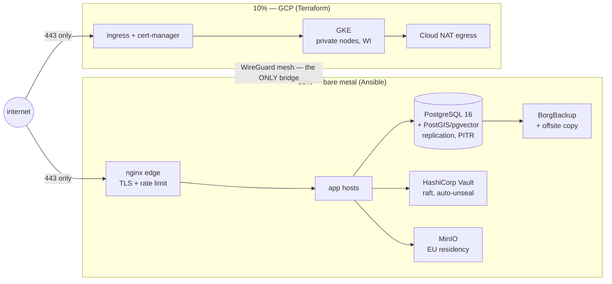

# Architecture — the Marketplace Moat

Inherited from jol-repo-template; extended with the 90/10 topology.
Authoritative decisions live in `adr/`; this document is the map.

## The 90/10 topology

## Plane ownership

| Plane      | Tool       | Source of truth                     | State custody            |
|------------|------------|-------------------------------------|--------------------------|
| bare metal | Ansible    | `ansible/` (pending workstream)     | host facts + vault files |
| GCP        | Terraform  | `terraform/environments/`           | GCS, CMEK, versioned (ADR-0002/0003) |
| governance | Terraform  | `terraform/modules/github-org`      | same as GCP state        |

## Cross-cutting doctrine

- **Trust boundaries:** `../security/isolation-model.md` — the bridge is
  WireGuard and nothing else.
- **Network:** default-deny matrices in `../security/network-policy.md`.
- **Secrets:** custody register in `../security/key-custody.md`; runtime
  delivery via Vault (30-vault) — never baked into images or IaC.
- **Backups/DR:** `../backup/` — RTO ≤ 4h, RPO ≤ 15min, drilled quarterly.
- **Observability:** `../monitoring/` — alerts encode the RTO/RPO promises.

## Data residency & privacy

All personal data stays in EU regions (GDPR Art. 44). Offsite backups are
EU-resident and client-side encrypted (`../backup/borg/offsite-repo.md`).
New data flows require a DPIA pass (`DPIA-template.md`).

## Compliance mapping (summary)

| Framework  | Anchor in this repo                                          |
|------------|---------------------------------------------------------------|
| SOC 2      | branch protection + CODEOWNERS (CC6.1/CC8.1), drift detection (CC7.3) |
| ISO 27001  | segregation (A.8.13), hardening (A.8.8), logs (A.8.15-17)      |
| GDPR       | residency rules here + Art. 35 DPIA template                    |
| PCI-DSS    | scope document `../security/pci-dss-scope.md`                   |
